# Automated Micro-Influencer Outreach System

[](https://github.com/mitul-bhatia/assignment_edxso/actions/workflows/tests.yml)

-green)

An end-to-end, resumable pipeline that **discovers** real Technology micro-influencers on YouTube,
**filters and classifies** them with explainable reasons, **enriches** them with sourced contact
details, **writes personalized outreach** (email + Instagram DM) with an LLM, and **sends or
simulates** it through an idempotent, logged sending layer, with a human review step in between.

Built for **EDXSO AI Engineer Intern, Assignment 1**.

> **Live demo (read-only):** _add your Vercel link here_ · **Demo video:** _add your link here after recording_

**Honesty guarantees.** No influencer record, email address or metric is invented. Every email has a
source URL and a confidence label; when none is found it is stored as `Not Found`. Unavailable data
(audience age, gender, geography) is marked `Not Available`. The demo campaign brief is illustrative
and is **not approved for live outreach**; real sending is disabled by default.

---

## Results of the reference run (2026-10-04)

| Stage | Result |
|---|---|
| Channels discovered | **1,484** (requirement: 50+) |
| In the 5k–100k follower range | 333 |
| With recent, measurable videos | 300 |
| With a real audience (view floor, reach, engagement) | 222 |
| **Qualified (passed every rule)** | **116** (3 `PRIORITY`, 113 `STANDARD`) |
| Qualified with a published email | 56 (60 stored as `Not Found`) |
| Valid personalized drafts (email + DM) | 106 of 116 (the rest are retried by `personalize`) |
| Automated tests | 72 passing |

Every one of the 1,368 non-qualified channels stores the exact reasons it failed. Review status and
the manual audit are tracked in [docs/EVALUATION.md](docs/EVALUATION.md).

---

## How it works

```mermaid
flowchart LR
    A[YouTube Data API<br/>22 queries x 3 strategies x pages] --> B[Discovery<br/>quota-budgeted, resumable]
    B --> C[Objective rules<br/>followers, recency, reach, engagement]
    C -->|survivors only| D[LLM classification<br/>Gemini: tech focus, creator type]
    D --> E[Policy decision<br/>PASSED/FAILED + tier + reason codes]
    E --> F[Enrichment<br/>mine text, crawl public sites]
    F --> G[Personalization<br/>rule-chosen angle, LLM writes]
    G --> H[Human review<br/>approve / edit / reject]
    H --> I[Sending layer<br/>dry-run, test, live SMTP]
    I --> J[Outreach log + CSV exports]
```



| Stage | What it does | Module |
|---|---|---|
| **Discover** | Searches YouTube with a matrix of queries × strategies × pages. Every search is recorded and charged to a local quota ledger, so reruns never repeat paid work. Only in-range channels get their videos downloaded. | [src/discovery.py](src/discovery.py), [src/quota.py](src/quota.py) |
| **Filter** | Cheapest rules first. Followers 5k–100k; upload within 180 days; at least 3 videos with usable metrics; videos under 50 views excluded as noise; median views ≥ 200; reach ≥ 1% of subscribers; engagement ≥ 0.5%. Only survivors reach the LLM. | [src/policy.py](src/policy.py), [src/assessment.py](src/assessment.py) |
| **Classify** | Gemini labels technology focus, creator type and school relevance from titles and descriptions. The application validates the JSON and the evidence video IDs. A 0–100 fit score ranks creators; K-12 relevance sets a `PRIORITY` tier rather than acting as a gate. | [src/assessment.py](src/assessment.py) |
| **Enrich** | Mines emails already present in channel and video descriptions (no network), then crawls linked public sites for shortlisted creators (`robots.txt` respected, private network targets blocked). Rejects no-reply, platform and foreign support addresses; flags agency inboxes shared by several creators. | [src/enrichment.py](src/enrichment.py) |
| **Personalize** | Code picks the collaboration angle (ambassador, co-created resource, sponsored walkthrough, UGC tutorial), opening style and call-to-action from measured features. Gemini writes a 60–90 word email and a 15–30 word DM. Validators reject placeholders, ungrounded or off-topic text, hashtags, clichés and claims of having watched or enjoyed content. | [src/personalization.py](src/personalization.py) |
| **Review** | A person approves, edits or rejects each draft. Edits reset approval. | [src/outreach.py](src/outreach.py), `web/` |
| **Send** | Reserves a unique idempotency key before sending, then settles the outcome. At-most-once by design. Dry-run by default; real SMTP behind explicit gates. | [src/outreach.py](src/outreach.py), [src/mailer.py](src/mailer.py) |
| **Track** | Append-only outreach log, funnel report, CSV exports, run provenance. | [src/funnel.py](src/funnel.py), [src/exports.py](src/exports.py) |

The reasoning behind each design decision, with the measured evidence, is in
[docs/ARCHITECTURE.md](docs/ARCHITECTURE.md).

---

## Quick start

Requirements: Python 3.11+. Node.js 20+ only if you want the web workbench. The pipeline itself has
**no third-party dependencies**.

```bash
git clone https://github.com/mitul-bhatia/assignment_edxso.git
cd assignment_edxso
python3 -m venv .venv && source .venv/bin/activate     # Windows: .venv\Scripts\Activate.ps1
cp .env.example .env                                   # then add your keys (see below)
python -m unittest discover -s tests                   # offline, needs no keys
```

**Keys** (put them in `.env`, which is git-ignored):

| Variable | Needed for | Where to get it |
|---|---|---|
| `YOUTUBE_API_KEY` | Discovery | Google Cloud Console, enable *YouTube Data API v3* |
| `GEMINI_API_KEY` | Classification and message writing | Google AI Studio |
| `GROQ_API_KEY` | Optional alternative classifier | console.groq.com |
| `SMTP_*` | Optional real sending | e.g. a Gmail app password |

Run the pipeline:

```bash
python main.py run-all        # discover -> assess -> enrich -> personalize -> export
python main.py funnel         # where candidates are lost, and why
```

Open the reviewer workbench (optional):

```bash
python -m pip install -r requirements-api.txt
cd web && npm ci && npm run build && cd ..
python -m uvicorn server:app --host 127.0.0.1 --port 8000     # then open http://127.0.0.1:8000
```

The API has no authentication. Keep it on `127.0.0.1` and never expose it publicly.

---

## Hosted demo on Vercel (read-only)

The full app has no authentication and can spend API quota or send email, so it is **never** deployed
publicly. Instead the Vercel site is a frozen, read-only snapshot of a real run: the same React
workbench reading static JSON from `web/public/demo/`, with no backend and no secrets. Approve, edit,
send and run are disabled there. The site is marked `noindex` because it lists creators' public
business contact details.

1. Refresh the snapshot after any new run: `python main.py export && python main.py snapshot`, then commit.
2. On [vercel.com](https://vercel.com): **Add New, Project**, import this GitHub repository.
3. Set **Root Directory** to `web`. Vercel then detects Vite, and `web/vercel.json` supplies the build
   (`VITE_DEMO=1 npm run build`). No environment variables are needed.
4. Deploy. Every push to `main` redeploys automatically.

Local preview of the exact build: `cd web && VITE_DEMO=1 npm run build && npx vite preview`.

---

## Command reference

```bash
python main.py discover            # find channels (resumable; --refresh to redo)
python main.py assess              # measure, apply policy, classify survivors
python main.py rescore             # re-apply thresholds to stored labels: no API calls
python main.py enrich              # emails and links for all profiles
python main.py personalize         # write email + DM for qualified creators (resumable)
python main.py revalidate          # re-check stored drafts against current validators
python main.py funnel              # funnel and failure reasons
python main.py quota               # YouTube quota units used today
python main.py list --status PASSED
python main.py show CHANNEL_ID
python main.py approve CHANNEL_ID  # or reject CHANNEL_ID
python main.py send --limit 5      # dry run: simulate the approved emails
python main.py send --live --to you@example.com --limit 1   # real SMTP, delivered to YOU as a test
python main.py suppress someone@example.com                  # never contact again
python main.py mark-dm CHANNEL_ID  # record a manual Instagram DM
python main.py add-contact CHANNEL_ID EMAIL SOURCE_URL       # verify an email on a public page
python main.py audit-sample        # stratified sample to label by hand
python main.py audit-score         # precision / recall from your labels
python main.py export              # write the three CSVs to data/exports/
python main.py snapshot            # freeze the data into static JSON for the Vercel demo
```

---

## Sending layer

* Selects only creators who are qualified, have a valid sourced email and an **approved** message.
* **Dry-run by default.** Nothing leaves the machine.
* **At-most-once.** A unique key (`campaign + recipient`, separate namespace per mode) is reserved
  in the log *before* sending. A failure that provably never left (bad credentials, refused
  recipient) releases the key for retry. An ambiguous failure becomes `SEND_UNCERTAIN` and is never
  retried automatically. Repeats are logged as `DUPLICATE_BLOCKED`.
* **Real outreach needs all of:** `--live`, `SMTP_*` settings, an approved message,
  `campaign.live_outreach_approved: true` in `config.json` (it is `false`), and it stays under
  `sending.daily_cap`. `--to you@example.com` routes every message to the operator for testing.
* Opt-out list (`suppress`), unsubscribe footer, paced live sends.
* **Instagram DMs** are generated for review. They are never sent through any unofficial route; a
  reviewer opens the creator's public profile and records a manual send.

Statuses: `SIMULATED_SENT`, `SENT`, `SEND_FAILED`, `SEND_UNCERTAIN`, `DUPLICATE_BLOCKED`,
`SKIPPED_NO_EMAIL`, `SUPPRESSED`, `MANUAL_DM_RECORDED`.

---

## Outputs

| File | Contents |
|---|---|
| `data/exports/influencers.csv` | Every discovered channel: metrics, tier, score, email + source + confidence, themes, pass/fail with reason codes and text |
| `data/exports/messages.csv` | Email subject/body, DM, cited video, collaboration angle, model, validation and review state |
| `data/exports/outreach_log.csv` | Influencer, email, message generated, sent, date, status |

## Configuration

Everything tunable lives in [`config.json`](config.json): queries, search strategies and pages,
quota budget, every filter threshold, the campaign brief, collaboration angles and call-to-action
variants, and the sending cap. After editing thresholds run `python main.py rescore`. For a strict
K-12-only campaign set `filters.minimum_school_relevance` to `3`.

## Project layout

```
main.py            command-line entry point
server.py          local FastAPI service for the workbench
config.json        all tunable settings
src/               pipeline modules (see the table above)
web/               React reviewer workbench (Vite)
tests/             72 offline tests
docs/              ARCHITECTURE, EVALUATION, TROUBLESHOOTING
data/exports/      generated CSVs
```

## Testing

```bash
python -m unittest discover -s tests -v
```

The suite is offline and covers the policy rules, discovery resilience (quota, pagination, partial
failures), contact-mining safeguards, message validators, rate-limit handling, the at-most-once
sender and the funnel/audit reports. Several regression tests were verified by mutation: reintroducing
the original bug makes them fail.

## Limitations

* YouTube is the only discovery source. Instagram is used for DM drafts only.
* Metrics are public proxies, not YouTube Analytics. Audience age, gender and geography are
  `Not Available`; a channel's country is never presented as audience geography.
* About half of qualified creators publish a findable email. YouTube's business-email CAPTCHA is
  deliberately not automated.
* Emails from video descriptions are lower confidence; `shared_address` rows are agency inboxes.
* LLM output needs human review. Validators check structure and lexical grounding, not truth.
* Thresholds and score weights are calibrated on one run; check them with `audit-sample` /
  `audit-score`.
* Gemini free-tier daily limits throttle message generation; the pipeline stops cleanly and resumes.
* Live SMTP sending is implemented and unit-tested with a mock transport but has not been exercised
  against a real mail server.
* Single-operator prototype on SQLite. See [docs/ARCHITECTURE.md](docs/ARCHITECTURE.md) for the
  scaling path to 500+ creators.

## Data notice

`data/exports/` contains business contact emails that creators themselves published on their public
YouTube channels or websites, each with its source URL. If you appear in the dataset and want your
entry removed, open an issue and it will be deleted.

## Responsible use

This project reads only public data, respects `robots.txt` on third-party sites, never guesses an
address, never bypasses platform restrictions, and keeps live sending off until a campaign is
explicitly approved. Do not use the demo brief for real outreach, and do not share `.env`.

## Documentation

[Architecture and design principles](docs/ARCHITECTURE.md) ·
[Evaluation worksheet](docs/EVALUATION.md) ·
[Troubleshooting](docs/TROUBLESHOOTING.md)
